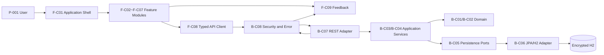
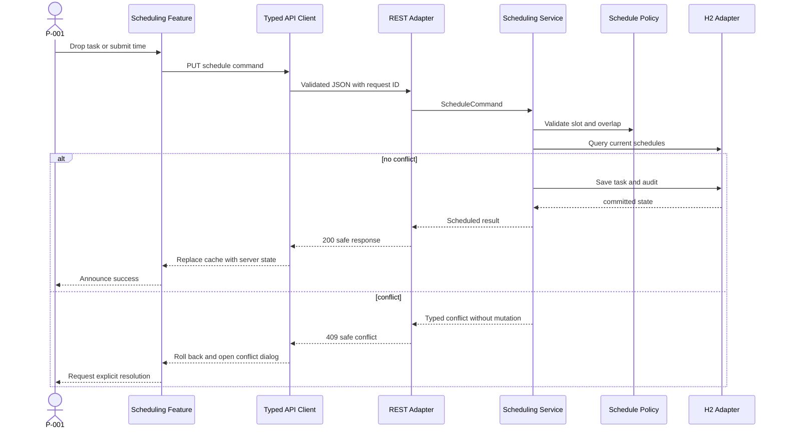

# Component Dependencies and Data Flow

## Dependency Rules

1. Backend adapters depend inward on application ports; application depends on domain and ports.
2. Domain depends only on Java standard/domain types.
3. Frontend routes compose feature modules; features depend on the typed API adapter and shared primitives.
4. Backend OpenAPI is the source for generated frontend transport types, not domain types.
5. Durable writes cross exactly one REST application-service boundary and one transaction boundary.

## Backend Dependency Matrix

| From | May Depend On | Must Not Depend On |
|---|---|---|
| B-C01 Task Domain | domain value types | Spring, JPA, HTTP, H2 |
| B-C02 Schedule Policy | B-C01 value types | Spring, JPA, controllers |
| B-C03 Planning Application | B-C01, B-C02, B-C05 ports | B-C06 concrete JPA, B-C07 controller |
| B-C04 Query Application | B-C05 ports, query DTO interfaces | JPA repository implementation, HTTP |
| B-C05 Persistence Ports | domain/application types | Spring Data implementation |
| B-C06 JPA/H2 Adapter | B-C05, Spring Data, Flyway | REST, frontend |
| B-C07 REST Web Adapter | B-C03, B-C04, B-C08 | B-C06 direct repository |
| B-C08 Security/Error Platform | web framework and safe error contracts | domain mutation internals |

## Frontend Dependency Matrix

| From | May Depend On | Must Not Depend On |
|---|---|---|
| F-C01 Application Shell | feature public APIs, shared tokens | feature internals, raw fetch |
| F-C02 Weekly Planner | F-C05, F-C08, F-C09 | backend-specific entities |
| F-C03 Backlog | F-C05, F-C08, F-C09 | raw HTTP, list internals |
| F-C04 Task Editor | F-C08, F-C09 | timetable layout internals |
| F-C05 Scheduling Interaction | F-C02/F-C03 public adapters, F-C06, F-C08 | persistence details |
| F-C06 Conflict Resolution | safe conflict contract, F-C09 | collision reimplementation as authority |
| F-C07 Task List | F-C08, F-C09 | timetable internals |
| F-C08 API Client | generated OpenAPI types, HTTP primitive | React view components |
| F-C09 Feedback System | accessible shared primitives | domain or persistence logic |

## Component Flow

### Text Alternative

P-001 → Application Shell → feature modules → typed API client → security/error filters →
REST adapter → application services → domain and persistence ports → JPA/H2 adapter → encrypted
H2. 결과와 안전한 오류는 역방향으로 feature와 accessible feedback system에 전달된다.

## Schedule Mutation Flow

### Text Alternative

사용자 제안은 frontend → typed client → REST validation → scheduling service로 이동한다.
service는 현재 DB 상태를 조회하고 domain policy로 재검증한다. 충돌이 없을 때만 task와
audit를 commit한다. 충돌이면 mutation 없이 409를 반환하고 frontend는 preview를 rollback한
뒤 명시적 해결을 요청한다.

## Contract and Build Flow

1. Backend source generates and validates OpenAPI.
2. Frontend generates transport types/client bindings from the approved OpenAPI artifact.
3. Backend contract tests verify examples and error schema.
4. Frontend component tests mock only the typed client boundary.
5. Integrated Playwright tests run against the real backend and H2 test profile.
6. CI fails when generated types differ from the committed/expected contract.

## Security Trust Boundaries

- **Browser boundary**: all browser input is untrusted even when client-validated.
- **HTTP boundary**: content type, body size, DTO and rate limits run before application service.
- **Application boundary**: typed commands are revalidated against domain/current DB state.
- **Persistence boundary**: parameter binding only; encryption key arrives from environment.
- **Logging boundary**: request ID and event metadata only; no raw description or secret.

