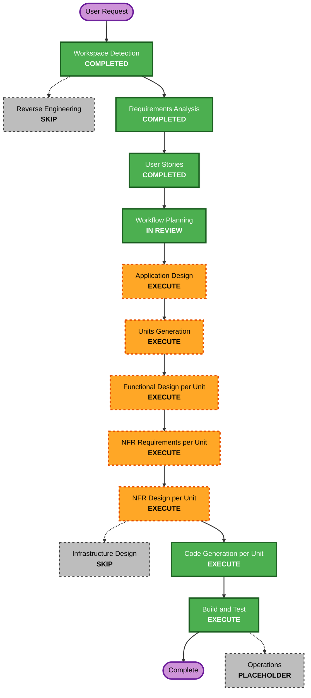

# Execution Plan

## 1. Detailed Analysis Summary

### Project Context

- **Project type**: Greenfield full-stack web application
- **Primary user value**: 미배치 할 일을 실제 주간 시간에 배치하고 충돌을 명시적으로 해결
- **Frontend**: React + Vite 기반 반응형 주간 타임테이블과 목록
- **Backend**: Java + Spring Boot REST, H2 파일/인메모리 프로필
- **Quality constraints**: 양측 TDD, E2E, 부분 PBT, 코드 변경별 보안 리뷰

### Change Impact Assessment

| Area | Impact | Detail |
|---|---|---|
| User-facing | High | 타임테이블, 백로그, 목록, 상세 폼, 충돌 해결과 모바일 흐름 신규 구축 |
| Structural | High | 독립 frontend/backend 빌드와 REST 계약, 모듈러 모놀리스 신규 구축 |
| Data model | High | task, schedule, audit 데이터와 Flyway 스키마 신규 정의 |
| API | High | `/api/v1` CRUD, 주간 조회, 배치·충돌, 상태 전이 계약 신규 정의 |
| Security | High | 암호화 H2, 입력 검증, 헤더, CORS, rate limit, 안전한 오류와 공급망 검사 |
| Testing | High | 프론트·백엔드 단위/통합, 계약, E2E와 시간 도메인 PBT 구축 |

### Risk Assessment

- **Risk level**: Medium
- **Rollback complexity**: Moderate. Greenfield이므로 코드 롤백은 쉽지만 DB 마이그레이션과 파일 데이터 복원이 필요함
- **Testing complexity**: Complex. drag/drop, 시간 경계, 충돌 경합, 모바일·키보드 흐름이 여러 계층에 걸침
- **Primary risks**: 시간 계산 불일치, 충돌 시 데이터 덮어쓰기, 프론트·API 계약 이탈, 보안 규칙 누락, UI가 데스크톱 전용 그리드로 고착

## 2. Proposed Units

### U1 Backend Planning Core

- task/schedule 도메인, 충돌 판정, application service
- REST API, validation, safe error, rate limit와 security headers
- H2 file/in-memory profiles, Flyway, audit trail
- JUnit/MockMvc/H2 integration/jqwik tests

### U2 Frontend Planning Experience

- application shell, weekly timetable, backlog, task form와 list view
- drag/drop 및 키보드 대체 배치, conflict resolution UI
- responsive desktop/mobile layout, accessibility와 feedback states
- Vitest/RTL/fast-check/Playwright tests

### Coordination Strategy

- **Approach**: Hybrid sequential
- **Critical path**: U1 domain과 OpenAPI 계약 → U2 API client와 실제 연동
- **Parallel opportunity**: 계약 승인 후 U1 구현과 U2 mock 기반 UI를 병행할 수 있음
- **Integration checkpoint**: 각 세로 슬라이스별 API contract test와 최종 Playwright E2E

## 3. Workflow Visualization

### Text Alternative

1. Workspace Detection 완료 → Reverse Engineering 건너뜀 → Requirements Analysis 완료.
2. User Stories 완료 → Workflow Planning 검토 → Application Design 실행.
3. Units Generation 실행 → 각 유닛의 Functional Design, NFR Requirements와 NFR Design 실행.
4. Infrastructure Design 건너뜀 → 각 유닛 Code Generation 실행.
5. 전체 Build and Test 실행 → Operations는 placeholder로 종료.

## 4. Phases to Execute

### INCEPTION PHASE

- [x] Workspace Detection — greenfield 확인
- [x] Reverse Engineering — SKIP: 기존 애플리케이션 코드 없음
- [x] Requirements Analysis — 13 FR, 8 NFR 및 확장 규칙 확정
- [x] User Stories — P-001과 10개 세로 슬라이스 완료
- [ ] Workflow Planning — IN REVIEW
- [ ] Application Design — EXECUTE
  - **Rationale**: 신규 frontend/backend 컴포넌트, 서비스 계층, REST 계약과 의존 관계 정의 필요
- [ ] Units Generation — EXECUTE
  - **Rationale**: 두 빌드 패키지, 신규 데이터 모델·API, 시간 충돌 로직과 상태 관리의 작업 분해 필요

### CONSTRUCTION PHASE

- [ ] Functional Design per Unit — EXECUTE
  - **Rationale**: task/schedule 모델, 충돌 알고리즘, UI 상태 전이와 반응형 상호작용 설계 필요
- [ ] NFR Requirements per Unit — EXECUTE
  - **Rationale**: Security Baseline, 접근성, 성능, 테스트 커버리지와 PBT 프레임워크 기준 필요
- [ ] NFR Design per Unit — EXECUTE
  - **Rationale**: validation, encryption, logging, error, rate limit, test architecture를 논리 컴포넌트에 반영
- [x] Infrastructure Design — SKIP
  - **Rationale**: 클라우드·외부 네트워크·배포 인프라가 없고 로컬 H2·프로필·CI는 NFR/Application Design으로 충분
- [ ] Code Generation per Unit — EXECUTE
  - **Rationale**: TDD 계획 승인 후 실제 frontend/backend 코드와 테스트 생성
- [ ] Build and Test — EXECUTE
  - **Rationale**: 양측 빌드, 단위·통합·계약·PBT·E2E·보안·SBOM 검증

### OPERATIONS PHASE

- [x] Operations — PLACEHOLDER/SKIP
  - **Rationale**: 현재 AI-DLC Operations는 placeholder이고 배포는 범위 밖임

## 5. Detailed Execution Sequence

1. **Application Design**: 컴포넌트, 서비스, REST 경계, 데이터 흐름과 보안 책임 정의.
2. **Units Generation**: U1/U2 범위, 의존성, 스토리·FR 할당과 통합 순서 확정.
3. **U1 Functional Design**: task/schedule aggregate, 충돌·상태 전이, API와 schema 상세화.
4. **U1 NFR Requirements/Design**: H2 암호화, validation, 감사, rate limit, safe error, JUnit/jqwik 설계.
5. **U1 Code Generation**: 실패 테스트부터 backend 구현, 코드 변경별 보안 리뷰.
6. **U2 Functional Design**: timetable geometry, drag/keyboard state, forms, query/cache와 responsive flow 상세화.
7. **U2 NFR Requirements/Design**: 접근성, CSP, error recovery, 성능, Vitest/fast-check/Playwright 설계.
8. **U2 Code Generation**: 실패 테스트부터 frontend 구현, 코드 변경별 보안 리뷰.
9. **Build and Test**: 전체 build, coverage, integration, E2E desktop/mobile, dependency audit와 SBOM.

## 6. Quality Gates

- 모든 plan step은 수행 즉시 `[x]`로 갱신한다.
- 모든 FR/NFR은 design, task, code와 test까지 안정 ID로 추적한다.
- 각 코드 묶음은 TDD와 `04-security-review-checklist.md`를 통과한다.
- Security Baseline 적용 항목과 PBT partial 항목의 미충족은 차단 결함이다.
- frontend/backend coverage, contract, 접근성, responsive와 E2E 기준을 모두 통과한다.
- 사용자가 승인하지 않은 phase 또는 unit으로 이동하지 않는다.

## 7. Effort and Deliverables

- **Remaining workflow stages**: Application Design, Units Generation, 2개 유닛의 3개 설계 단계와 Code Generation, Build and Test
- **Execution units**: 2
- **Calendar estimate**: 승인 응답 속도와 의존성 설치 환경에 좌우되므로 고정하지 않음
- **Primary deliverables**: 실행 가능한 SPA/API/H2 앱, 테스트 전체, 보안 리뷰 기록, 빌드·테스트 지침과 AI-DLC 추적 문서

## 8. Extension Compliance

- **Security Baseline**: Compliant. 적용 가능한 모든 규칙이 실행 단계와 quality gate에 배치됨. SECURITY-02/06/12/14의 클라우드·인증 부분은 범위상 N/A.
- **Property-Based Testing Partial**: Compliant. U1/U2 시간 도메인 설계와 코드·CI 단계에 PBT-02/03/07/08/09 배치.
- **Resiliency Baseline**: Disabled by approved requirement choice.
- **Blocking findings**: 없음.

